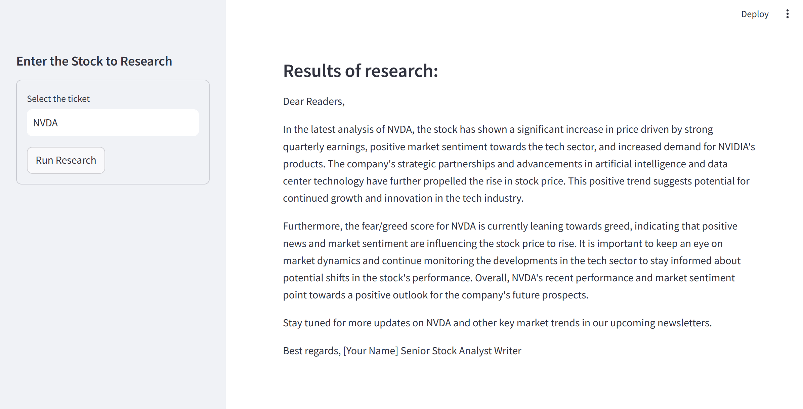

# Stock Analysis Research Tool

This repository provides a comprehensive tool for analyzing stock prices and generating insights based on both historical price trends and recent market news. It leverages a combination of financial data from Yahoo Finance, news analysis using DuckDuckGo, and the powerful capabilities of OpenAI's GPT model to produce a detailed stock analysis and newsletter.

## Features

* **Yahoo Finance Integration** : Fetches historical stock price data for the last year.
* **News Analysis** : Analyzes recent market news and provides a sentiment analysis (fear/greed score).
* **Automated Report Generation** : Combines stock price trends and news analysis to generate a three-paragraph newsletter.
* **Streamlit Interface** : A user-friendly interface to input stock ticker symbols and run the analysis.

## Setup

### Prerequisites

* Python 3.7+
* Streamlit
* yfinance
* langchain
* OpenAI API key
* DuckDuckGo API key (for news analysis)

### Installation

1. Install the required packages:	`pip install -r requirements.txt`
2. Set up your environment variables:
   * Add your OpenAI API key to your environment.
   * Ensure `OPENAI_API_KEY` is set in your environment variables.
3. Run the Streamlit app: `streamlit run app.py`

## Agents and Tasks

### Agents

* **Stock Price Analyst** : Analyzes historical stock prices to determine the current trend (up, down, or sideways).
* **Stock News Analyst** : Analyzes market news related to the stock and provides a sentiment score.
* **Stock Analyst Writer** : Generates a three-paragraph newsletter based on the stock price analysis and news sentiment.

### Tasks

* **getStockPrice** : Fetches and analyzes stock price data.
* **get_news** : Analyzes market news for the specified stock and Bitcoin.
* **writeAnalyses** : Generates a newsletter based on the outputs of `getStockPrice` and `get_news`.
